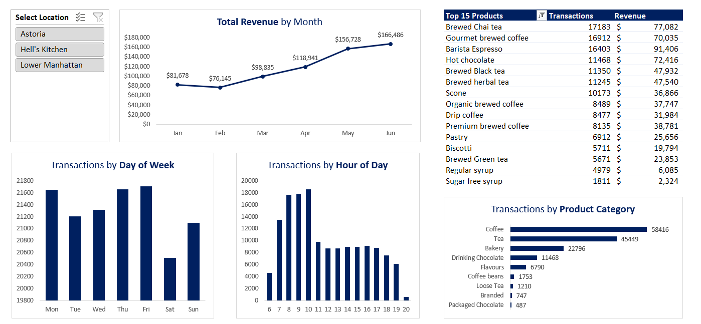
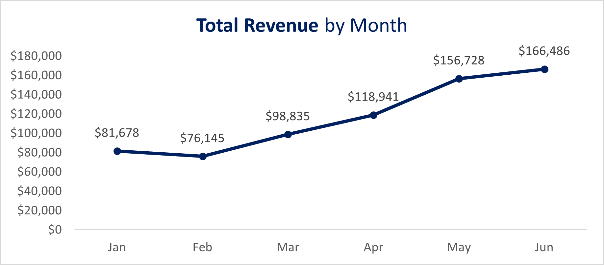
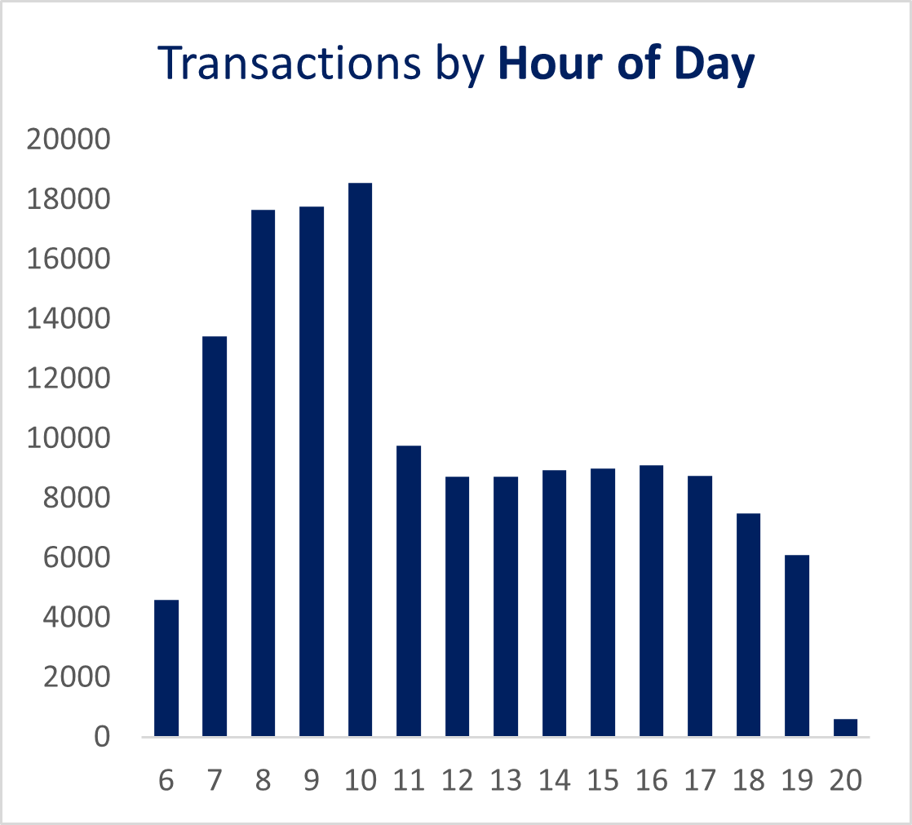
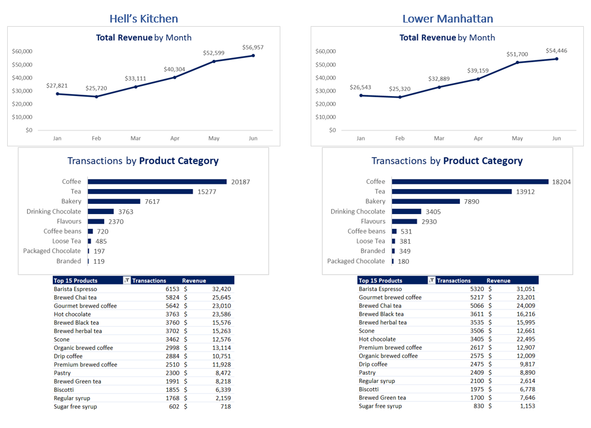
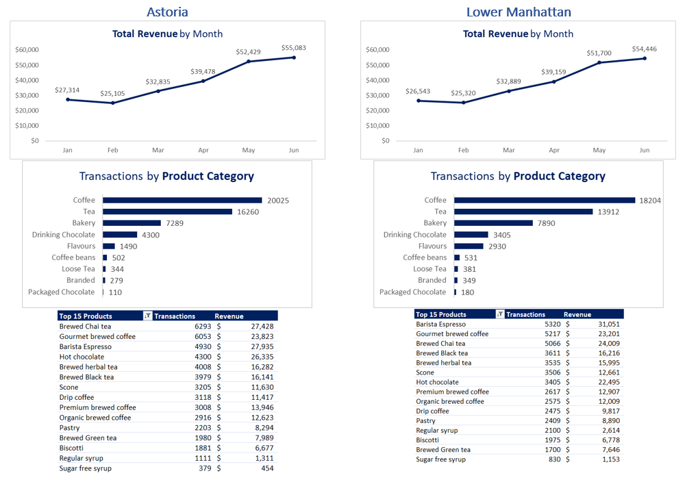
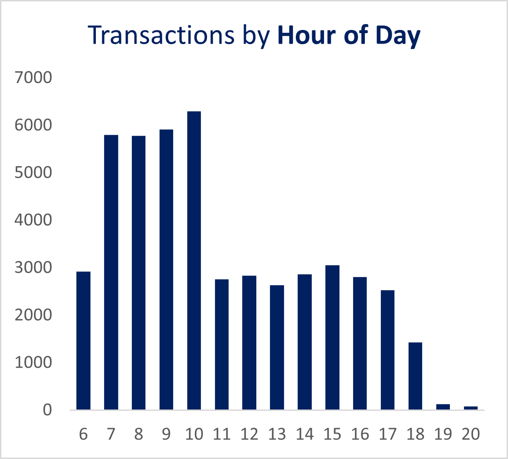

# Project 01 - Coffee Shop Sales Analysis

## Project Files

📊 Dashboard Workbook:
[Download Dashboard](Coffee%20Shop%20Dashboard.xlsx)

📄 Dataset:
[Download Dataset](Coffee%20Shop%20Sales.xlsx)

📝 Documentation:
This README contains the complete project methodology, analysis, findings, and recommendations.

## Key Highlights

- 149,116 transaction records analyzed
- 3 NYC store locations compared
- Power Query data transformation
- Interactive Excel dashboard
- Business insights and strategic recommendations

## Project Overview

This project analyzes six months of transactional sales data from a coffee shop chain operating across three New York City locations:

* Astoria
* Hell's Kitchen
* Lower Manhattan

The objective was not simply to create charts and PivotTables, but to approach the dataset as a Business Intelligence analyst would in a real business environment: understanding the structure of the data, preparing it for analysis, identifying key performance indicators, uncovering operational insights, and translating findings into actionable business recommendations.

The analysis was conducted using Excel, Power Query, PivotTables, and dashboarding techniques.

**Tools Used**

* Microsoft Excel
* Power Query
* PivotTables
* Dashboard Design
* Business Performance Analysis

---

# The Analysis Journey

## Step 1 — Understanding the Data Before Touching the Numbers

The dataset contained 149,116 transaction records and the following fields:

* Transaction ID
* Transaction Date
* Transaction Time
* Transaction Quantity
* Store ID
* Store Location
* Product ID
* Unit Price
* Product Category
* Product Type
* Product Detail

Before creating any calculations or visualizations, I first determined the grain of the dataset.

A critical question in every analysis is:

> What does one row represent?

By investigating the Transaction ID field, I confirmed that every Transaction ID was unique.

This meant that each row represented a single transaction rather than multiple products grouped under a shared order.

This conclusion determined how every KPI would later be calculated.

I also established the observation period:

* Start Date: January 1st, 2023
* End Date: June 30th, 2023

This provided six months of operational activity for analysis.

---

## Step 2 — Structuring the Data

The raw dataset was converted into an Excel Table to ensure:

* Dynamic ranges
* Structured references
* Reliable PivotTable creation
* Scalability
* Easier filtering and maintenance

The table became the central source for all reporting and dashboard components.

---

## Step 3 — Feature Engineering

Raw operational data rarely contains every field needed for meaningful business analysis.

Several analytical features were created using Power Query.

### Revenue

A Revenue column was created:

Revenue = Transaction Quantity × Unit Price

This transformed operational activity into measurable business value.

### Month

Month names were extracted from Transaction Date:

* Jan
* Feb
* Mar
* Apr
* May
* Jun

### Day of Week

A Day of Week field was created:

* Mon
* Tue
* Wed
* Thu
* Fri
* Sat
* Sun

### Hour

An Hour field was extracted from Transaction Time to support traffic pattern analysis throughout the day.

---

## Step 4 — Building the Business Framework

Rather than creating visualizations immediately, I organized the analysis around a simple Business Intelligence framework:

### Time

Questions:

* Is revenue growing?
* Which months perform best?
* Which days perform best?
* Which hours perform best?

### Location

Questions:

* Which store performs best?
* Are customer behaviors different by location?
* Are some locations more efficient than others?

### Product

Questions:

* Which products drive sales?
* Which products drive revenue?
* Which categories dominate demand?

This framework ensured that every chart and KPI answered a meaningful business question.

---

# KPI Development

The dashboard was designed to answer five core questions:

### 1. Is revenue growing?

Revenue by month was analyzed to evaluate growth patterns.

### 2. When do customers visit?

Transactions were analyzed by:

* Day of Week
* Hour of Day

### 3. Which categories dominate?

Transaction volume was analyzed by Product Category.

### 4. Which products matter most?

The Top 15 products were ranked by:

* Transaction Count
* Revenue

### 5. How do locations differ?

Store-level comparisons were conducted across all KPIs.

---

# Business Insights

## Insight 1 — Revenue Growth Remains Strong

Revenue increased consistently from January through June across all locations.

Rather than exhibiting isolated spikes, the business demonstrated sustained growth over six consecutive months.

This suggests increasing customer demand, stronger customer retention, higher transaction frequency, or a combination of these factors.

The business has not yet shown signs of reaching a growth plateau.

---

## Insight 2 — The Business Is Heavily Dependent on Morning Traffic

Transaction activity peaks between approximately 7:00 AM and 10:00 AM before declining sharply throughout the remainder of the day.

This confirms that the business operates primarily as a morning-driven coffee business.

The greatest growth opportunity may not be improving already-successful morning performance but rather increasing demand during afternoon hours.

A company cannot double its morning traffic forever.

It can, however, improve underutilized periods of the day.

---

## Insight 3 — Lower Manhattan Generates More Value Per Customer Interaction

In June, Hell's Kitchen generated approximately $56,957 in revenue from roughly 20,187 coffee transactions.

Lower Manhattan generated approximately $54,446 from only 18,204 coffee transactions.

Despite processing nearly 2,000 fewer transactions, Lower Manhattan achieved almost identical revenue performance.

This indicates a meaningfully higher Average Order Value (AOV) and suggests that customers in Lower Manhattan purchase higher-value products or premium product combinations more frequently.

A likely driver is the strong performance of Barista Espresso, which generated approximately $31,051 from 5,320 transactions, representing an average transaction value of approximately $5.84 per purchase.

### Business Implication

The two stores appear similar from a revenue perspective but operate under fundamentally different economic models.

Hell's Kitchen relies on transaction volume.

Lower Manhattan relies on transaction quality.

Future analysis should investigate margin contribution, basket composition, and customer behavior by location.

---

## Insight 4 — Astoria Operates Like a Different Business

Astoria displays a product mix that differs substantially from both Manhattan locations.

While coffee remains important, Brewed Chai Tea emerges as the strongest individual product driver, generating approximately $27,428 in revenue.

Tea transaction volume nearly matches coffee transaction volume.

This behavior contrasts sharply with Lower Manhattan, where coffee overwhelmingly dominates customer demand.

### Business Implication

The evidence suggests that Astoria serves a different customer profile than the commuter-oriented Manhattan stores.

Applying identical marketing campaigns, product placement strategies, and store experiences across all locations may limit growth opportunities.

Astoria should be treated as a distinct market segment rather than as a smaller version of the Manhattan stores.

---

## Insight 5 — The Syrup Upsell Opportunity

Regular Syrup generated approximately 4,979 transactions while contributing only around $6,085 in revenue.

This equates to roughly $1.22 per modifier purchase.

Flavor modifiers are among the highest-margin products in the beverage industry due to their low ingredient cost and strong customer acceptance.

### Business Implication

The current pricing structure may underutilize one of the most profitable revenue streams available to the business.

Even modest increases in modifier pricing could generate meaningful profit growth without requiring additional customer traffic.

---

## Insight 6 — Evening Traffic Requires Investigation, Not Immediate Cost Cutting

Lower Manhattan experiences a sharp decline in transaction activity during the final operating hours.

At first glance, this appears to support reducing operating hours.

However, transaction data alone is insufficient to support that conclusion.

### Potential Explanation 1 — Soft-Close Behavior

Employees may begin closing procedures before official closing time by:

* Cleaning equipment early
* Reducing menu availability
* Closing display cases
* Beginning floor maintenance

In such cases, low transaction counts may reflect reduced service availability rather than reduced customer demand.

### Potential Explanation 2 — Point-of-Sale Timing Effects

The final hourly period often represents only a partial trading window.

As a result, the final bar on an hourly chart can appear artificially weak.

### Business Implication

Reducing operating hours without understanding these dynamics risks eliminating profitable customer demand rather than eliminating unprofitable operating time.

Additional information is required before making operational changes:

* Labor costs
* Gross margins
* Staffing schedules
* Customer traffic data
* Competitive operating hours

---

# Strategic Recommendations

## 1. Launch an Afternoon Revenue Strategy

Transaction volume falls dramatically after the morning peak.

Management should explore demand generation between 1 PM and 4 PM.

Potential actions:

* Promote cold beverages and specialty drinks
* Introduce afternoon bundles
* Adjust menu boards after morning rush periods
* Review staffing levels to maintain service quality

---

## 2. Build Astoria Around Its Tea Ecosystem

Astoria demonstrates a unique customer profile.

Potential actions:

* Expand premium tea offerings
* Introduce matcha-based products
* Develop wellness-focused beverages
* Optimize seating for longer customer stays
* Encourage bakery attachment sales

---

## 3. Optimize Modifier Pricing

Modifier products represent a potentially underexploited profit driver.

Potential actions:

* Standardize syrup pricing
* Introduce premium modifier tiers
* Bundle modifiers into specialty drinks
* Test pricing elasticity through controlled experiments

---

## 4. Measure Hourly Profitability Before Adjusting Store Hours

Before changing operating schedules:

* Calculate revenue by hour
* Estimate labor cost by hour
* Estimate gross margin by hour
* Benchmark against nearby competitors

Store-hour decisions should be based on profitability rather than transaction volume alone.

---

# Key Lessons

This project reinforced several principles that guide effective Business Intelligence work:

1. Understand the structure of the data before creating calculations.
2. Define the grain of the dataset before building KPIs.
3. Create analytical fields that support business questions.
4. Think in terms of measures and dimensions.
5. Focus on decisions rather than charts.
6. Every insight should generate a new business question.
7. Recommendations should be evidence-based and transparent about uncertainty.

---

# Final Outcome

This project transformed more than 149,000 transaction records into an interactive business dashboard capable of answering questions related to growth, customer behavior, product performance, operational efficiency, and strategic opportunities.

More importantly, the project demonstrates a complete Business Intelligence workflow—from raw transactional data to business recommendations—showcasing both technical execution and analytical thinking applicable to real-world Data Analyst and Business Intelligence roles.
